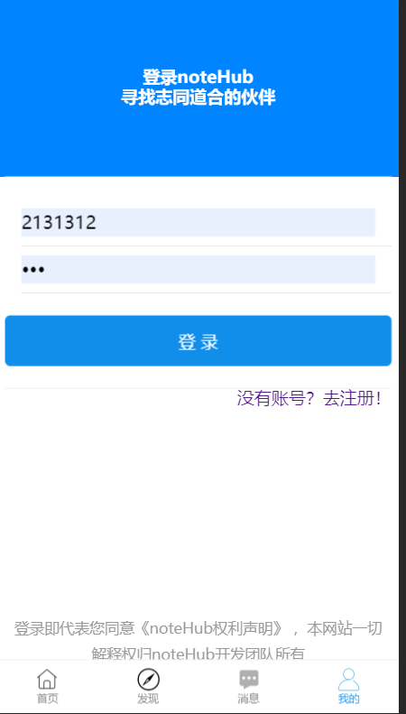
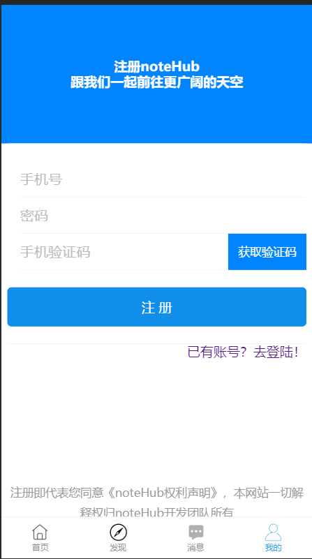
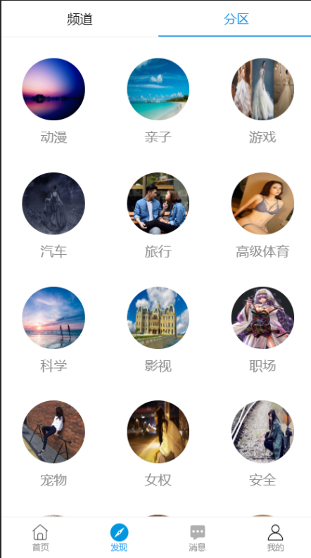

# 项目名称：noteHub
## 团队与分工
> 组长：曾少塨,成员：谭兆良，叶卓斌

* 叶卓斌
    * 主要负责移动端的静态页面
    * 主要负责移动端路由与页面数据渲染

## 项目目录说明
* notehub-client-side
* src
    * api 接口
    * assets 资源文件
    * components 公共组件
    * redux redux文件
    * utils 工具包
    * views 视图组件
    * App.js 主页面文件
    * index.js 入口文件
* config-overrides.js webpack配置文件

## 项目页面截图

