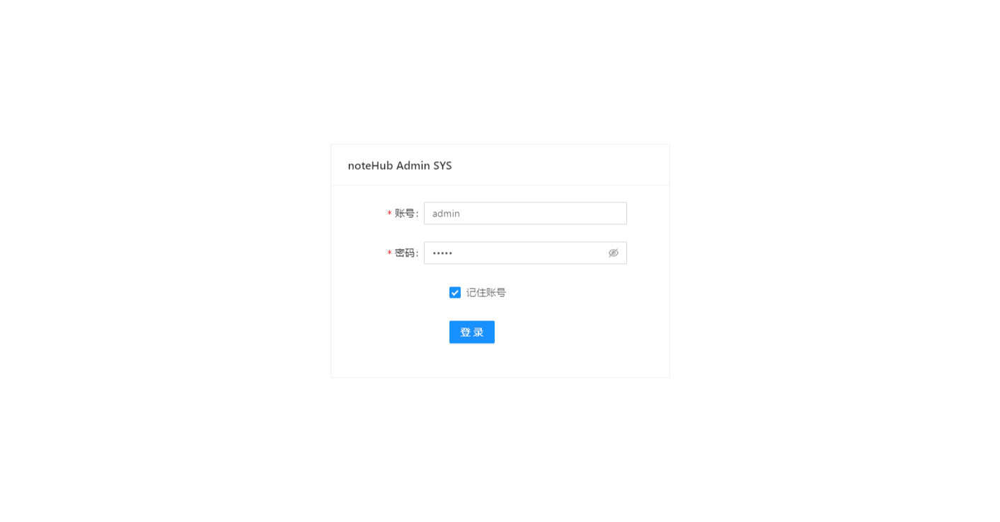
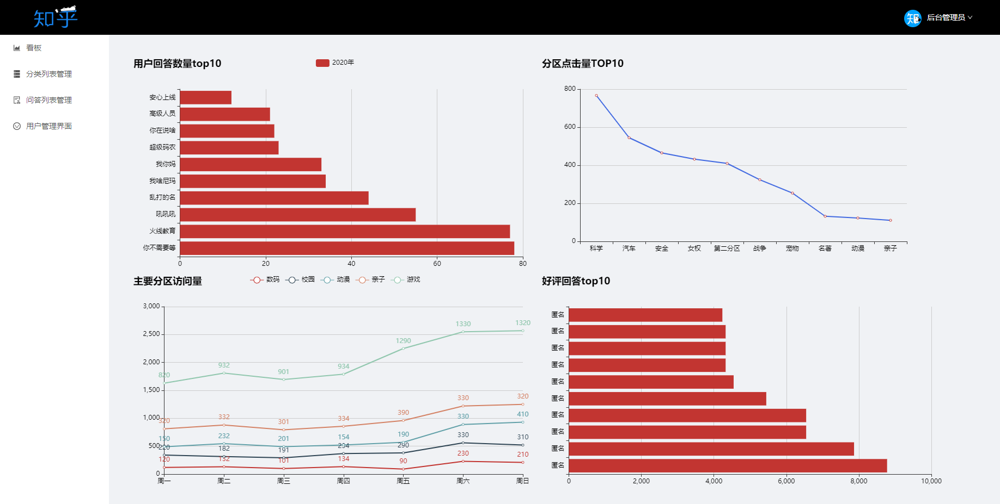
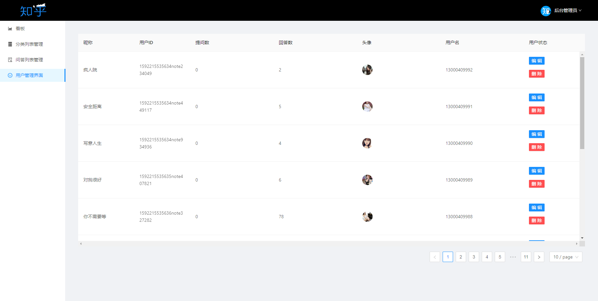
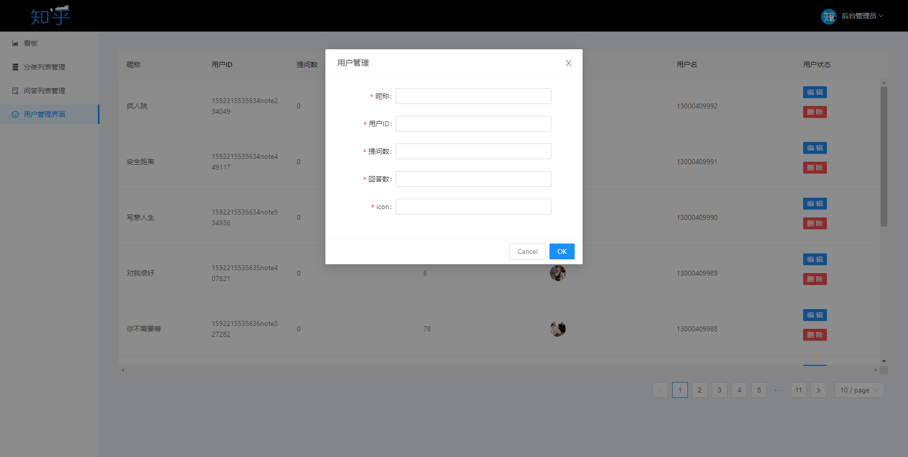

 - pages 页面资源目录
	 		- Login.js 登陆界面
			- admin 目录
				- dashboard 看板模块
				- products 分类列表模块
					- list.js 分类列表管理
					- edit.js 分类列表添加模块
					- upload.js 图片上传方法封装
				- question 问题列表模块
					- esList.js 问题列表管理
				- user 用户管理模块
					- List.js 用户列表管理
					- Edit.js 用户信息编辑管理
 - routes 路由文件目录
 - services 接口方法封装
 - utils 用户令牌
 - app 入口文件

### 登录界面login

### src/pages/admin/dashboard 看板页面

### src/pages/admin/prodect 分类列表页面

### src/pages/admin/question 问题列表页面

### src/pages/admin/user 用户列表页面

